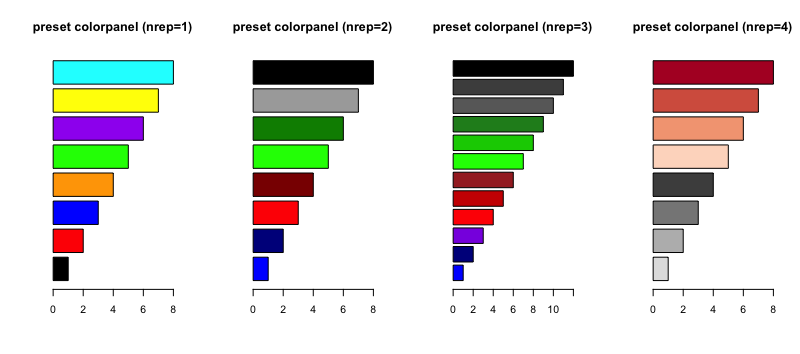

## Introduction  
This script is designed to process isothermal dose (or very similarly, time) response CETSA result
from TMT10 labelling and quantification scheme.  
The main tasks include:  
1. Read in some data (Search result txt.file from Proteome Discoverer, PD) into R/Rstudio  
2. Clean up data, mainly to remove the entries without quantitative information  
3. Normalize data based on the principle that each channel should contain same amount of input material  
4. Try to fit each entry of data into a dose/time-response relationship and capture the fitting parameters  
5. Generate a QC report to have an overview about the data quality, such as quantified protein number etc  
6. Visualize the data using customizable plot layout, for either all the data or the subsets  

--------------------------------------------------------------------------------------------

## Prerequisites
* R version > 3.3.0 
* Rstudio version > 0.99, preferably > 1.0
* Dependent packages (will be handled during the package installiation process automatically):  
"readr", "drc", "plyr", "tibble", "tidyr", "grid", "gtools", "gridExtra", "scales", "RColorBrewer", "dplyr", "ggplot2"  
However, if complained, use `install.packges()` command to manually install a paticular package  

--------------------------------------------------------------------------------------------


## Proceessing
1. For better organization of data analysisk, it is __highly recommended__ to use the [Project management feature](https://support.rstudio.com/hc/en-us/articles/200526207-Using-Projects) in Rstudio.   
For each project, you are suggested to create a brand new working folder as your local working directory.  
Save the PD derived data files to this working directory folder.  
At the right up corner of Rstudio, click Project -> New Project -> Existing Directory -> browse and choose the designated working directory folder.  
By establishing a specfic project for each experiment, all the data content and execution history will be saved in the project for future analysis even when R session is terminated.  

2. Activate `mineCETSA` package by library it.  
```{r, message=TRUE}
library("mineCETSA")
```

3. Read in data from result files, `ms_ITDR_rawread()` is designed for read in one or many files in a vector of file names.  
By default, `PD21=TRUE` assume the data is searched using PD2.1; otherwise, specify `PD21=FALSE` if data originated from PD2.0  
Refer to "Data searching using PD2.1" for how-to.  
Note that for simplicity, always use channel __126__ as control channel for data search in PD, regardless of the labelling arrangement.  
You need to specify a `dose` vector of the compound concentration used corresponding to the labelling done from 126 up to 131, of which the function default is `dose=c(400,100,25,6.25,1.56,0.391,0.098,0.0245,0.006,0)`.  
Similarly for ITTR experiment, you need to specify a treatment `time` vector, of which the default is `time=c(0,10,20,30,45,60,90,120,150,180)`.  
When protein abundance values are present in PD2.1 rawdata, they would be extracted by default and used for sysmtematic normalization in the next step.  
```{r, eval=FALSE}
ITDRdata <- ms_ITDR_rawread(c("SN1.txt", "SN2.txt", "ST1.txt", "ST2.txt"), PD21=TRUE, dose=c(20,5,1.25,0.3123,0.078125,0.019531,0.004883,0.001221,0.000305,0))
```

```{r, echo=FALSE, message=TRUE}
ITDRdata <- ms_ITDR_rawread(c(system.file("extdata", "SN1.txt", package="mineCETSA"), system.file("extdata", "SN2.txt", package="mineCETSA"), system.file("extdata", "ST1.txt", package="mineCETSA"), system.file("extdata", "ST2.txt", package="mineCETSA")), PD21=TRUE, dose=c(20,5,1.25,0.3123,0.078125,0.019531,0.004883,0.001221,0.000305,0))
#print(unique(ITDRdata$outdir))
```

```{r}
#ITDRdata_1file <- ms_ITDR_rawread("SN1.txt", PD21=TRUE, dose=c(20,5,1.25,0.3123,0.078125,0.019531,0.004883,0.001221,0.000305,0))

#ITTRdata <- ms_ITTR_rawread(c("file1.txt", "file2.txt", "file3.txt", "file4.txt"), PD21=TRUE, time=c(0,5,10,15,20,30,45,60,90,120))
```

4. Customize the condition names in dataset using `ms_conditionrename()`.  
When read in multiple files, a number suffix is added to the condition of each data file in sequence   
This condition remaning is important for group assignment and ITDR/ITTR hits selection in the following filter function. A format of _"Experimental conditon.Replicate number"_ is suggested. More specifically, the following three formats are supported: 1) condition names followed by dot and number (eg, DMSO.1, 37C.2); 2) condition names followed by dot and rep and number (eg, DMSO.rep2, 52C.rep1); 3) condition names followed by dot and letter r and number (eg, Ctrl.r1, dTITTR37C.r2).  
__It is recommended that you should try to omit using dot in the condition names, you can segregate your long condition name using underline if necessary.__  
The argument `incondition` corresponses to current condition naming, whereas `outcondition` correponses to new condition naming, both order and length should match exactly.  
```{r}
ITDRdata <- ms_conditionrename(ITDRdata, incondition=c("staurosporine.3","staurosporine.4"), outcondition=c("ST.1","ST.2"))
```

5. Remove not-quantified and Keratin proteins by default using `ms_clean()`.  
By default the orphan proteins that appear only in one of the datasets is not removed, however you can specify `remsinglecondprot=TRUE`, these orphan proteins will be excluded from downstream analysis.  
```{r}
ITDRdata_c <- ms_clean(ITDRdata)
#ITTRdata_c <- ms_clean(ITTRdata)
```

6. Apply systematic scaling to the dataset using `ms_ITDR_scaling()` or `ms_ITTR_scaling()`.  
The function achieve: 1) For dataset with protein abundance information, the total abundances in each channel are adjusted to be the same (i.e., average of all channels). 2) For dataset without protein abundance information but only calculated ratio information, the median of ratios in each channel are adjusted to be the same (i.e., 1). 3) Automatically check and re-arrange the treatment dose (or time) in ascending order.  
Output in working directory:  
* Scaling factors used is written into a local file.  
* Medians of pre- and post- data normalization is plotted.  
* The distribution of raw and normalized protein abundance is plotted.  
```{r}
ITDRdata_s <- ms_ITDR_scaling(ITDRdata_c)
#ITTRdata_s <- ms_ITTR_scaling(ITTRdata_c)
```

7. Try to perform dose/time-response function fitting to generate fitting parameters for each entry/curve using `ms_ITDR_fitting()` or `ms_ITTR_fitting()`.  
The returned data contains the input scaled data plus fitting parameters (including `EC`/`ET`, `R2`, and `Slope`). Parameter `fc` (short for fold change) indicated the response level the fitting function used to back-calculate the corresponding `EC` (short for Effective concentration).   
For `ms_ITTR_fitting()`, similarly the `ET` (short for Effective time) is calculated.  
A copy of the fitted dataset would be saved in current working directory.  
```{r,eval=FALSE}
ITDRdata_f <- ms_ITDR_fitting(ITDRdata_s)
#ITTRdata_f <- ms.ITTR_fitting(ITTRdata_s)
```

8. Generate a QC report for the dataset using `ms_IDIT_QC()`, ideally the scaled data with fitting parameter should be used as input.  
The arguments and its default value includes:  
* `foldername=NULL`, can specify a foldername to keep the QC report if preferred
* `nread=10`, how many readings are there per entry/curve in the dataset, default is 10
* `isdatafitted=TRUE`, whether data with fitting parameters were used as input
```{r,eval=FALSE}
ms_IDIT_QC(ITDRdata_f)
ms_IDIT_QC(ITDRdata_s, isdatafitted=FALSE, foldername="QC1")
```

9. Carry out data segregation and positive hits selection based on desired `fc` level and the associated fitting parameters using `ms_ITDR_filter()`.  
The arguments and its default value includes:  
* `fcthreshold=0.3`, readings have to surpass this threshold (by default 30%) of fold change level to be considered as positive  
* `R2threshold=0.8`, minimal R-squared (R2) level to consider dose/time-reponse fitting as reliable  
* `checkreplicate=FALSE`, whether to check replicated measurements, when set to TRUE, the filter function will make sure the proteins with all the replicated measurements from at least one condition pass fold change threshold will be segregated, default set to FALSE  
* `ncheckpoint=3`, the checking of whether readings surpass fold change threshold is applied on the highest three doses
* `PSMcutoff=FALSE` and `PSMthreshold=3`, whether to apply minimal PSM cutoff on hit selection and the threshold level  
  
  
Returned values: The return data is in list format, when `checkreplicate=TRUE` and `PSMcutoff=TRUE`, there are 4 items: selected proteins, proteins with single replicate passing fold change criteria, proteins with no more than on average 3 PSMs, not selected proteins; when `checkreplicate=TRUE` and `PSMcutoff=FALSE`, there are 3 items: selected proteins, proteins with single replicate passing fold change criteria, not selected proteins; when `checkreplicate=FALSE`, there are only 2 items: selected proteins, and not selected proteins.  
In the case of ITTR data, the `ms_ITTR_filter()` function is very similarly performed.  
However, when there is 37C-heated samples (used to check protein expression level change but not to explore protein stabilty change), you need to provide an extra argument `treatcondition=c()` to specify the heat challenging condition keyword (say, 52C) used in the experiment.  
```{r, eval=FALSE}
ITDRdata_filtered <- ms_ITDR_filter(ITDRdata_f, fc=0.3, checkreplicate=TRUE, PSMcutoff=TRUE)
#ITTRdata_filtered <- ms_ITTR_filter(ITTRdata_f, checkreplicate=TRUE, PSMcutoff=TRUE)
```

10. Plot out dose response curves for each segregated data item in the list returned from the above filter function using `ms_ITDR_ggplotting()` or `ms_ITTR_ggplotting()`.  
The arguments and its default value includes:  
* `nread=10`, how many readings per curve (count from lowest dose) were used for plotting, default is 10  
* `remsinglecondprot=TRUE`, whether orphan proteins to be plotted, default to exclude them from plotting  
* `nreplicate=2`, how many replicates there are for each condition, default is duplicate thus 2, change the value accordingly, this is relavent to automatic coloring scheme, up to 4 is possible for now  
* `orderAUC=FALSE` or `orderEC=FALSE`, whether to order the plots by AUC (Area under the curve) or EC (Effective concentration), set to TRUE if necessary  
For ITTR data, the corresponding argument is `orderAUC=FALSE` or `orderET=FALSE`    
* `unit="mM"`, the default unit for dose is mM, change to appropriate character accordingly  
* `layout=c(5,5)`, the default multiplot layout is 5 times 5 in each page  
* `presetcolor=TRUE`, whether automatically apply the preset coloring scheme for each condition, otherwise, provide a vector for example `colorpanel=c("black", "red", "blue", "orange")` to customize the colors. The preset colorpanel associated to each replicate value is as follows:  
  
Refer to [Colors in R](http://www.stat.columbia.edu/~tzheng/files/Rcolor.pdf) or [R Color Cheatsheet](https://www.nceas.ucsb.edu/~frazier/RSpatialGuides/colorPaletteCheatsheet.pdf) for more color selection. 
* `xlinear=FALSE`, `xlog10=TRUE`, `xsqrt=FALSE`, by default use log10 transformed scale but not linear scale or square root transformed scale for x-axis  
For ITTR data, the default is `xlinear=FALSE`, `xlog10=FALSE`, `xsqrt=TRUE`, so that the x axis is displayed in square root transformed scale.  
* `dotconnect=FALSE`, by default to fit the best dose/time response regression curve, however, by specifing `dotconnect=TRUE` you could skip the curve fitting.  
```{r, eval=FALSE}
ms_ITDR_ggplotting(ITDRdata_filtered[[1]], orderAUC=TRUE)
#ms_ITTR_ggplotting(ITTRdata_filtered[[1]], orderAUC=TRUE)
```
Note: It has been reported that for Mac user, an error *"Error in grid.Call(L_textBounds, as.graphicsAnnot(x$label), xx, xy,  : polygon edge not found"* tend to pop up when executing the plotting function and stop it. One solution is to export the data and plot in basic R terminal.  
(170324 update: This problem should be solved in the current version of package, otherwise follow the aforementioned suggestion)  


11. Export the scaled data (virtually any data in the current working space) using `ms_filewrite()` to a local txt file.
```{r, eval=FALSE}
ms_filewrite(ITDRdata_filtered[[1]], "ITDRdata_good.txt")
ms_filewrite(ITDRdata_filtered[[2]], "ITDRdata_single.txt")
ms_filewrite(ITDRdata_filtered[[3]], "ITDRdata_PSMsmall.txt")
ms_filewrite(ITDRdata_filtered[[4]], "ITDRdata_notselected.txt")
```

12. Read in the exported data (virtually any data in the current working space) using `ms_fileread()` from a saved txt file.
```{r, eval=FALSE}
ITDRdata_selected_good <- ms_fileread("./subfolder/ITDRdata_good.txt")
# . indicate the current working directory
# Here the subfolder refer to the first level folder name under current working directory in which the data file locates
# Remember that typically now you are still working in the main working directory
```

13. Focus on a list of target proteins to study using `ms_subsetting()`.  
You need to make an excel file with a list of Uniprot IDs you want to study (for example, P00000, P12345-6) under the header “__id__”, then save as txt file in working directory, say under the name “hit_list.txt”. The alternative for a short list, you can simply provide a vector of Uniprot IDs.  
The arguments and its default value includes:  
* `isfile=TRUE`, whether the provided hitidlist is in a txt. file, default is set to TRUE
* `allisoform=TRUE`, whethre to retrive other isoforms of the same parental Uniprot ID, default is set to TRUE
* `revsel=FALSE`, short for reverse selection, when set to TRUE, the output is the dataset after removing the targets, default is set to FALSE
```{r, eval=FALSE}
ITDRdata_subset <- ms_subsetting(ITDRdata_f[[1]], hitidlist="hit_list.txt", isfile=TRUE)
ITDRdata_subset <- ms_subsetting(ITDRdata_f[[1]], hitidlist=c("P00000", "P12345-6"), isfile=FALSE)
```
